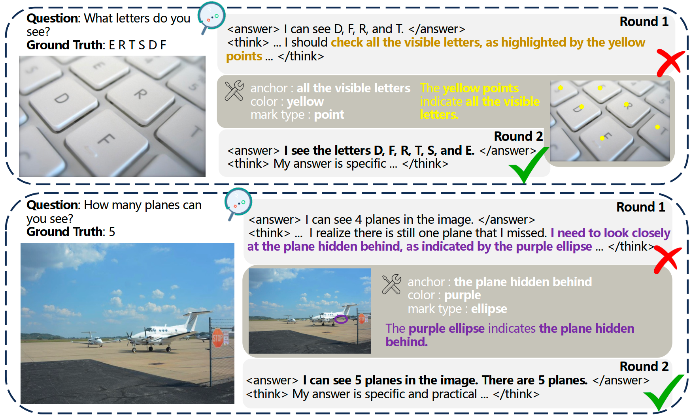
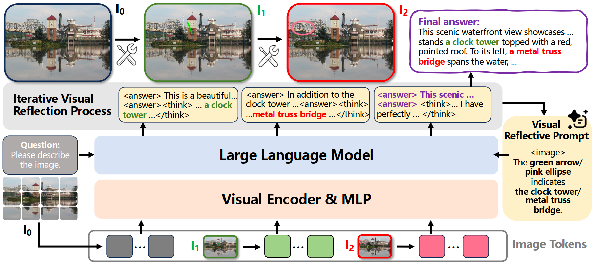
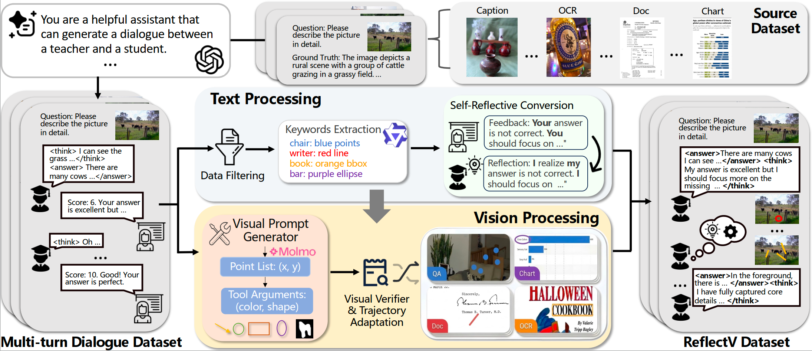
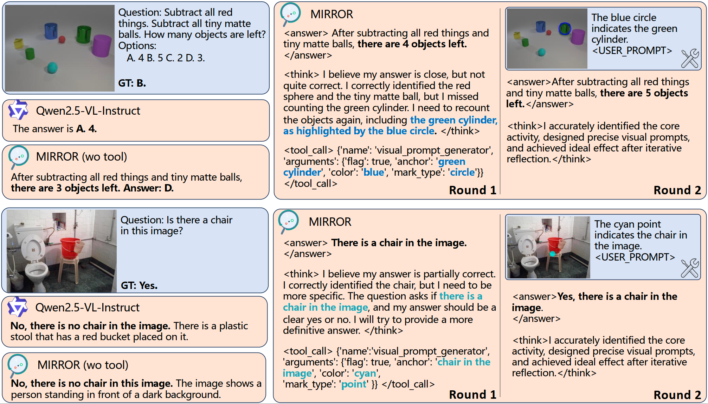

<div align="center">
  <h1 style="margin:0; font-size:2.5em; font-weight:bold;">
    
    MIRROR: Multimodal Iterative Reasoning via Reflection On Visual Regions
  </h1>

  <br>

  <a href="https://github.com/floy4/MIRROR/">
    
  </a>
  <a href="https://arxiv.org/pdf/2602.18746">
    
  </a>
  <a href="https://huggingface.co/datasets/3nnui/Reflect-V">
    
  </a>
</div>

<br>

<span>
Haoyu Zhang<sup>1,2</sup>, 
<a class="name" target="_blank" href="https://wu-yuwei-bit.github.io/">Yuwei Wu</a><sup>1,2</sup>, 
<a class="name" target="_blank" href="https://pengxiang-li.github.io/">Pengxiang Li</a><sup>1</sup>, 
<a class="name" target="_blank" href="https://github.com/xtong-zhang/">Xintong Zhang</a><sup>1</sup>, 
<a class="name" target="_blank" href="https://zhigao2017.github.io/">Zhi Gao</a><sup>1,2</sup>, 
Rui Gao<sup>1,2</sup>, 
Mingyang Gao<sup>1</sup>,
<a class="name" target="_blank" href="https://scholar.google.com/citations?user=nVMtrAoAAAAJ&hl=en">Che Sun</a><sup>2</sup>, 
<a class="name" target="_blank" href="https://scholar.google.com/citations?user=Sl6TV7gAAAAJ&hl=en">Yunde Jia</a><sup>2</sup>
<br />
<br />
<sup>1</sup>Beijing Key Laboratory of Intelligent Information Technology, School of Computer Science & Technology, Beijing Institute of Technology 
<sup>2</sup>Guangdong Laboratory of Machine Perception and Intelligent Computing, Shenzhen MSU-BIT University <br />
<!-- <sup>✉️</sup>Corresponding author -->
</span>

<!-- # 🔥News
- [2026/02/21] We released the preprint and the **ReflectV** dataset samples.  -->

<br>


# Abstract

<div align="center">
  
</div>

In the era of Vision-Language Models (VLMs),enhancing multimodal reasoning capabilities remains a critical challenge, particularly in handling ambiguous or complex visual inputs, where initial inferences often lead to hallucinations or logic errors. Existing VLMs often produce plausible yet ungrounded answers, and even when prompted to “reflect”, their corrections may remain detached from the image evidence. To address this, we propose the MIRROR framework for multimodal iterative reasoning via reflection on visual regions. By embedding visual reflection as a core mechanism, MIRROR is formulated as a closed-loop process comprising draft, critique, region-based verification, and revision, which are repeated until the output is visually grounded. To facilitate training of this model, we construct ReflectV, a visual reflective dataset for multi-turn supervision that explicitly contains reflection triggers, region-based verification actions, and answer revision grounded in visual evidence. Experiments on both general vision-language benchmarks and representative vision-language reasoning benchmarks show that MIRROR improves correctness and reduces visual hallucinations, demonstrating the value of training reflection as an evidenceseeking, region-aware verification process rather than a purely textual revision step.

<br>

# MIRROR Framework

### Method: Closed-Loop Reasoning


MIRROR upgrades standard VLM inference into a closed-loop verification cycle consisting of drafting, critiquing, region-based verification, and revision to ensure all reasoning steps are anchored in concrete visual evidence.

### ReflectV Dataset

The ReflectV dataset is synthesized through a multi-agent pipeline that transforms static multimodal QA samples into 24k high-quality reflective trajectories using a rigorous dialogue filtering strategy and a self-reflective conversion mechanism.

<br>

# Experimental Results
## Quantitative Results
### **🏆 Comparison with Base Models**
MIRROR consistently outperforms its backbone (Qwen2.5-VL-7B) and other strong open-source VLMs across diverse benchmarks, particularly in reducing hallucinations and enhancing fine-grained perception. The best and second-best results are highlighted in **bold** and <u>underlined</u>, respectively.

Performance comparison on General Capabilities and OCR & Document Benchmarks.  

| Model                  | Param Size | MM‑Vet | MMStar | SeedBench‑2‑Plus | TextVQA‑Val | OCRBench | ChartQA‑Test |
|------------------------|-----------:|-------:|-------:|-----------------:|-------------:|----------:|-------------:|
| LLaVA‑OneVision        | 7B         | 48.80  | 61.70  | --               | 76.10       | 62.10    | 80.00        |
| InternVL3              | 2B         | 54.95  | 60.70  | 64.95            | 77.00       | 82.20    | 76.08        |
| InternVL3              | 8B         | <u>64.27</u> | 61.50  | 69.61            | 80.51       | 85.00    | 79.64        |
| Qwen2.5‑VL‑3B          | 3B         | 47.39  | 55.87  | 68.81            | 79.12       | 82.60    | 83.20        |
| Qwen2.5‑VL‑7B          | 7B         | 56.60  | 61.21  | <u>70.88</u>     | 84.90       | 83.20    | 86.08        |
| **MIRROR (w/o tool)**  | 7B         | 59.91  | <u>62.80</u> | 70.36            | <u>85.37</u> | <u>88.30</u> | <u>86.56</u> |
| **MIRROR (ours)**      | 7B         | **66.70** | **73.33** | **76.86**        | **86.62**   | **92.00** | **87.92**    |
|

Performance comparison on Hallucination, Fine-grained Perception, and Reasoning Benchmarks.

| Model                  | Param Size | POPE   | HalluBench | HRBench‑4K | MME‑RW | VStarBench | MathVision |
|------------------------|-----------:|-------:|-----------:|-----------:|-------:|------------:|-----------:|
| LLaVA‑OneVision        | 7B         | 78.10  | 31.60      | 63.00      | --    | 72.30      | 18.30      |
| InternVL3              | 2B         | 89.60  | 42.50      | 61.75      | 43.88 | 68.59      | 21.71      |
| InternVL3              | 8B         | <u>90.37</u> | 49.90      | <u>70.00</u> | <u>48.83</u> | 68.06      | 20.39      |
| Qwen2.5‑VL‑3B          | 3B         | 86.21  | 63.09      | 50.25      | 42.15 | 72.77      | 25.66      |
| Qwen2.5‑VL‑7B          | 7B         | 86.45  | <u>68.66</u> | 68.87      | 44.29 | 75.39      | 23.36      |
| **MIRROR (w/o tool)**  | 7B         | 87.95  | 68.24      | 69.13      | 46.01 | <u>76.44</u> | <u>27.30</u> |
| **MIRROR (ours)**      | 7B         | **94.42** | **82.02**  | **72.88**  | **51.49** | **83.77**  | **28.29**  |
|

### **⚔️ Comparison with Reasoning Paradigms**
MIRROR addresses the inherent limitations of **Text Reflection** and **Thinking with Images** by incorporating a targeted feedback loop.

Performance comparison with SOTA reasoning methods, which are all fine-tuned on Qwen2.5-VL-7B. The best and second-best results are highlighted in **bold** and <u>underlined</u>, respectively.

| Method                 | OCRBench | POPE   | MME-RW | MMVet |
|------------------------|----------|--------|--------|-------|
| *Text Reflection*      |          |        |        |       |
| VL-Rethinker           | 85.40    | 84.19  | 47.21  | 56.19 |
| *Thinking with Images* |          |        |        |       |
| PixelReasoner          | 82.10    | 86.03  | 49.70  | 52.98 |
| DeepEyes               | <u>88.10</u> | 87.70  | 49.50  | 60.28 |
| Adaptive-CoF           | 86.00    | <u>89.30</u> | <u>50.90</u> | <u>66.21</u> |
| **MIRROR (ours)**      | **92.00** | **94.42** | **51.49** | **66.70** |
|

<br>

## Qualitative Results


* **Spatial Reasoning:** In object counting, standard models often miss small or cluttered items. MIRROR identifies its own counting error, triggers a **blue circle** on the neglected "green cylinder," and corrects the final count.
* **Object Identification:** To mitigate hallucinations, MIRROR actively queries the image with a **cyan point** to confirm the presence of a chair, ensuring the response is grounded in actual pixels rather than linguistic priors.

<br>

## Citation
```bibtex
@article{zhang2026mirror,
      title={MIRROR: Multimodal Iterative Reasoning via Reflection On Visual Regions},
      author={Zhang, Haoyu and Wu, Yuwei and Li, Pengxiang and Zhang, Xintong and Gao, Zhi and Gao, Rui and Gao, Mingyang and Sun, Che and Jia, Yunde},
      journal={arXiv preprint arXiv:2602.18746},
      year={2026}
}